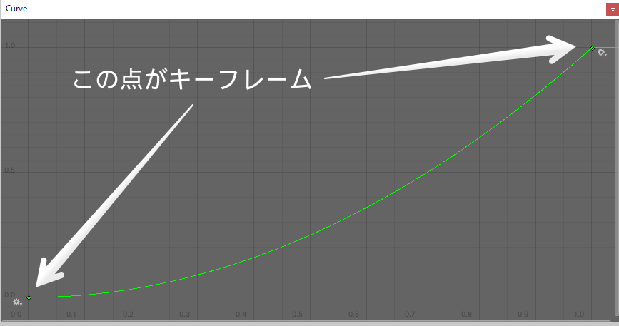
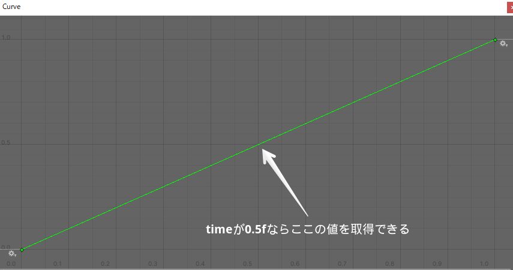
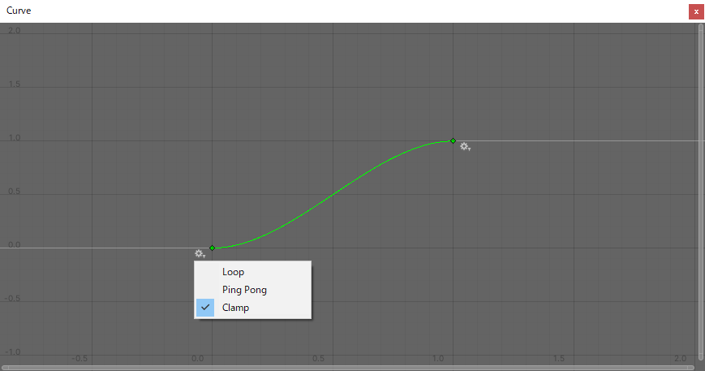
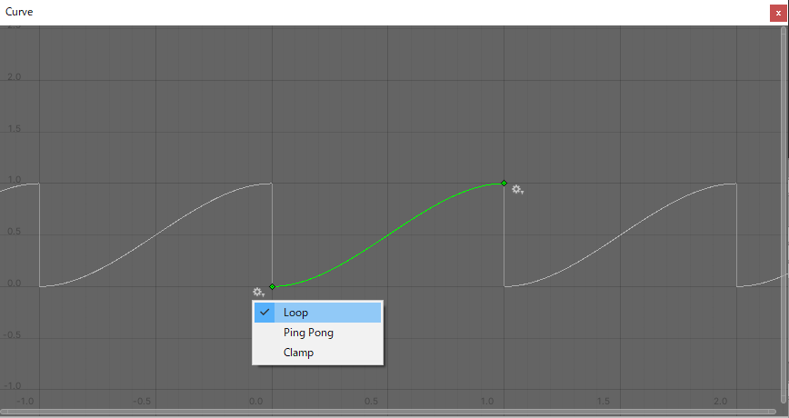
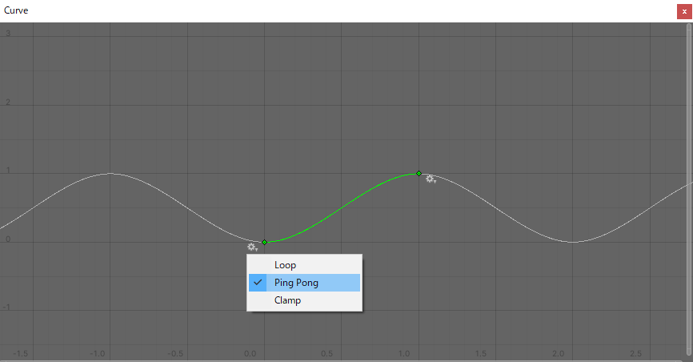

## はじめに

AnimationCurveはUnityでアニメーションの制御や、パーティクルの挙動を調整したりするときに使用されているクラスです。

名前にAnimationとありますが、「アニメーション」だけじゃなく「ゲームの難易度にカーブで変化を付ける」など、徐々に変化するものの表現に使うことができます。

## AnimationCurveの宣言

AnimationCurveを宣言する方法は複数あります。

```cs

using UnityEngine;

// 平行線
public AnimationCurve constant = AnimationCurve.Constant(
	timeStart: 0f,
	timeEnd: 1f,
	value: 1f
);

// 線形
public AnimationCurve linear = AnimationCurve.Linear(
	timeStart: 0f,
	valueStart: 0f,
	timeEnd: 1f,
	valueEnd: 1f
);

// EaseInOutを使ったカーブ
public AnimationCurve ease = AnimationCurve.EaseInOut(
	timeStart: 0f,
	valueStart: 0f,
	timeEnd: 1f,
	valueEnd: 1f
);

// キーフレームを自由に設定できる
public AnimtaionCurve keyframe = new AnimationCurve(
	new KeyFrame(0f,1f),
	new KeyFrame(1f,0f)
);
```

### Keyframe（キーフレーム）とは

キーフレームという単語が出てきましたが、これはAnimationCurveを構成する点のことを指します。

time（横軸）やvalue（縦軸）などの値を持っています。



-   [Scripting API: Keyframe](https://docs.unity3d.com/ScriptReference/Keyframe.html)

## AnimationCurveから、ある地点での値を取得する

**AnimationCurve.Evaluate関数**で、ある地点での値を取得することができます。

```cs

using UnityEngine;

// 線形
public AnimationCurve linear = AnimationCurve.Linear(
	timeStart: 0f,
	valueStart: 0f,
	timeEnd: 1f,
	valueEnd: 1f
);

public float GetValue (float time) {
	return linear.Evaluate(time);
}
```

Evaluate関数で実際にどういうことが行われているかは、画像を見ればわかりやすいです。



Curveウィンドウの左端には値（value）、下には時間（time）が表示されているのが分かります。

なので、この状態でlinear.Evaluate(time: 0.5f)を呼ぶと、返り値は**0.5f**となります。

### Wrap Mode

Evaluate関数のtime引数には基本的に、「キーフレームの最初から最後までの範囲（上記の例だと0.0f~1.0f）」で値を指定しますが、そこに収まらない値を指定することも可能です。

そういった「範囲に収まらない値」を指定した時の処理を制御するのが**WrapMode**になります。

```cs

using UnityEngine;

public AnimationCurve linear = AnimationCurve.Linear(
	timeStart: 0f,
	valueStart: 0f,
	timeEnd: 1f,
	valueEnd: 1f
);

void Start () {
	// キーフレームの前の処理を制御する
	linear.preWrapMode = WrapMode.Loop;

	// キーフレームの後の処理を制御する
	linear.postWrapMode = WrapMode.Loop;
}
```

WrapModeはenum型で、AnimationCurveでは主に以下の値を使用します。

#### WrapMode.Clamp

最初または最後のキーフレームの値で固定します。



#### WrapMode.Loop

キーフレームを繰り返します。



#### WrapMode.PingPong

往復するように、キーフレームを繰り返します。



## おわりに

AnmationCurveはインスペクターで視覚的にカーブを設定できる機能なので、ここぞという時に使っていきましょう。

## 参考

-   [Scripting API: AnimationCurve](https://docs.unity3d.com/ScriptReference/AnimationCurve.html)
-   [Scripting API: WrapMode](https://docs.unity3d.com/ScriptReference/AnimationCurve.html)
-   [Scripting API: Keyframe](https://docs.unity3d.com/ScriptReference/Keyframe.html)
