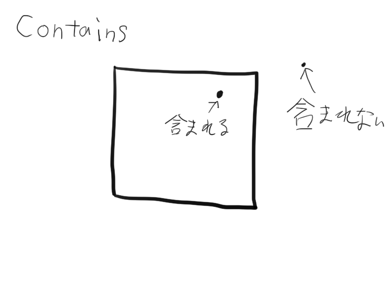
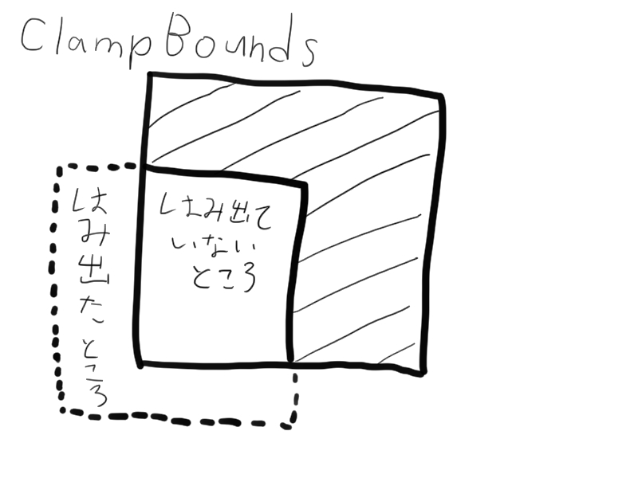

## BoundsIntとは？

BoundsIntはバウンディングボックス（仮想的な立方体）を表すBoundsのintバージョンです。

仮想的な立方体を使って、位置計算をしたりするときに役立ちます。

```cs

using UnityEngine;

// 位置が(0,0,0)でサイズが(5,1,5)のバウンディングボックス
public BoundsInt bounds = new BoundsInt(
	position: Vector3Int.zero,
	size: new Vector3Int(5,1,5)
);

// バウンディングボックスの中心
Vector3 center = bounds.center;

// バウンディングボックスの最低点、最高点
Vector3Int minPosition = bounds.min;
Vector3Int maxPosition = bounds.max;
```

## BoundsIntの便利な機能

BoundsIntを使う上で便利な機能を紹介していきます。

### Contains (Vector3Int position)

指定した位置がBoundsInt内にあるかどうかをチェックできます。



### ClampBounds (BoundsInt bounds)

バウンディングボックスが、指定したBoundsIntの中に収まるようにサイズを調整します。



### allPositionsWithin

BoundsIntの中に含まれるすべての位置を返すEnumeratorを返します。

これの挙動ですが、XYZの順に回します。

```cs

using UnityEngine;

void Start () {
	var bounds = new BoundsInt(
		position: Vector3Int.zero,
		size: new Vector3Int(3,3,3)
	);
	foreach (Vector3 position in bounds.allPositionsWithIn) {
		Debug.Log(position.ToString());
	}
	// 結果
	// (0, 0, 0)
	// (1, 0, 0)
	// (2, 0, 0)
	// (0, 1, 0)
	// (1, 1, 0)
	// (2, 1, 0)
	// (0, 2, 0)
	// (1, 2, 0)
	// (2, 2, 0)
	// (0, 0, 1)
	// (1, 0, 1)
	// (2, 0, 1)
	// (0, 1, 1)
	// (1, 1, 1)
	// (2, 1, 1)
	// (0, 2, 1)
	// (1, 2, 1)
	// (2, 2, 1)
	// (0, 0, 2)
	// (1, 0, 2)
	// (2, 0, 2)
	// (0, 1, 2)
	// (1, 1, 2)
	// (2, 1, 2)
	// (0, 2, 2)
	// (1, 2, 2)
	// (2, 2, 2)
}
```

## Bounds.positionの注意点

**positionはminと同じです。**

僕はこれの意味をcenterだと思って使った結果、数時間ハマったので気を付けてください。

**positionではなくminを使うことを強く推奨します。**（名前で挙動が分かりやすいものを使いましょう！）

## 参考

-   [Scripting API: BoundsInt](https://docs.unity3d.com/ScriptReference/BoundsInt.html)
