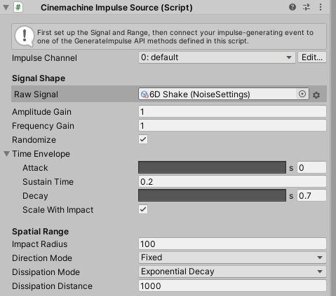
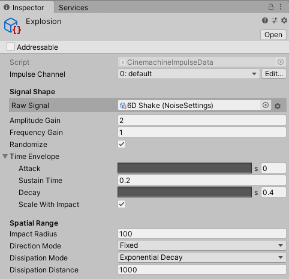
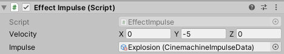

## はじめに

Cinemachineには、衝撃などの発生時にカメラを振動させるための「CinemachineImpulse」という機能があります。

実際にCinemachineImpulseを使おうとすると、大体このような感じで「Cinemachine Impulse Source」系のコンポーネントをアタッチして設定することになります。



ただ、僕はこのワークフローに欠点を感じています。

-   ゲームオブジェクトのインスペクターを圧迫する
-   複数のコンポーネント間で、同じImpulseを共有できない

今回紹介する方法は、この２つを解決できます。

## コード

以下のコードは、CinemachineImpulseをScriptableObjectとして実装するコードです。

```cs

using UnityEngine;
using Cinemachine;

[CreateAssetMenu]
public class CinemachineImpulseData : ScriptableObject {

	static readonly Vector3 k_DefaultVelocity = Vector3.down;

	[SerializeField, CinemachineImpulseDefinitionProperty]
	CinemachineImpulseDefinition m_Definition = new CinemachineImpulseDefinition();

	public CinemachineImpulseDefinition Definition => m_Definition;

	public void GenerateImpulse (Vector3 position) {
		m_Definition.CreateEvent(position,k_DefaultVelocity);
	}

	public void GenerateImpulse (Vector3 position,Vector3 velocity) {
		m_Definition.CreateEvent(position,velocity);
	}

#if UNITY_EDITOR
	void OnValidate () {
		m_Definition.OnValidate();
	}
#endif

}
```

実際にCinemachineImpulseDataのアセットを作成するとこのような感じになります。



## 実際に使ってみる

以下のコードは、実際にゲームで使っている「何かしらの効果（攻撃など）が発生したときにImpulseを発生させる」コンポーネントの例です。

```cs

using UnityEngine;
using UniRx;

public class EffectImpulse : MonoBehaviour {

	[SerializeField]
	Vector3 m_Velocity = Vector3.down;

	[SerializeField]
	CinemachineImpulseData m_Impulse;

	Transform m_Transform;
	GridEffectorBase m_GridEffector;

	readonly SerialDisposable m_Disposable = new SerialDisposable();

	void Awake () {
		m_Transform = transform;
		m_GridEffector = GetComponent();
	}

	void OnEnable () {
		m_Disposable.Disposable = m_GridEffector.OnAffected.Subscribe(_ => {
			m_Impulse.GenerateImpulse(m_Transform.position,m_Velocity);
		});
	}

	void OnDisable () {
		m_Disposable.Disposable = null;
	}

}
```

このコンポーネントを実際にインスペクターで表示すると以下のような感じになります。



とても簡素でインスペクターを圧迫せず、複数のコンポーネント間でImpulseを共有することができます。

## おわりに

ワークフローは大事
