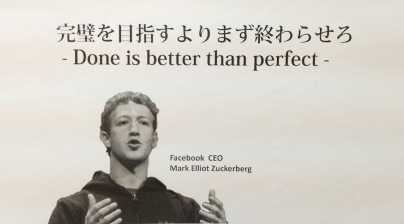
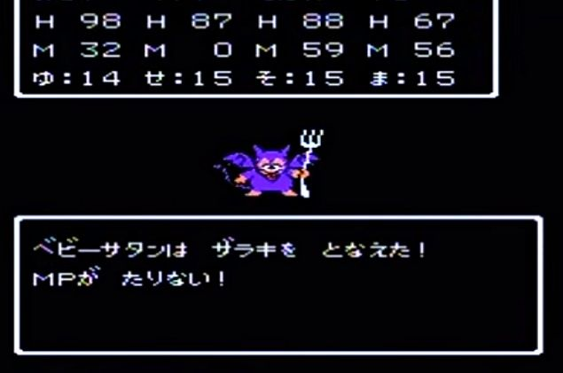
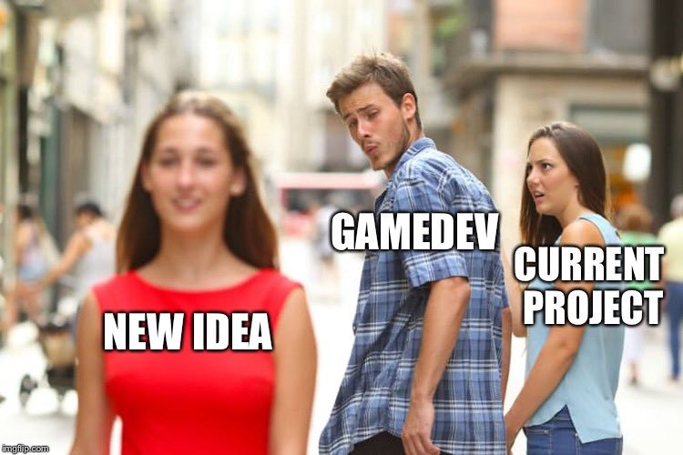
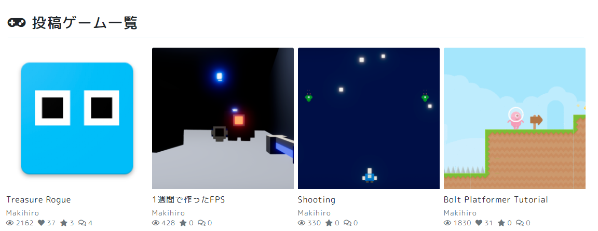

こんにちは、まきひろ（[@makihiro\_dev](https://twitter.com/makihiro_dev)）です。

ゲーム開発、大変ですよね。_巷_なんかだと、

> ゲームを作りたいと思う人が1000人
>
> ゲームを作り始めるのが100人
>
> ゲームを作り続ける人が10人
>
> ゲームを完成させるのが1人

こんなことを言われるぐらい、ゲーム開発は大変です。

この記事では僕のゲーム開発経験から、ゲームを完成させるコツを解説します。

とその前に、僕のゲーム開発の経歴について少し書いておきます。

## 筆者の経歴

僕のゲーム開発歴は6年です。個人でゲームを作っています。

最初の5年間は全くゲームをリリースさせることはできませんでした。この期間、10以上のプロジェクトが泡になりました。

そして6年目、ようやく初のゲームをリリースするに至りました。

[https://twitter.com/makihiro\_dev/status/1234444358067216387?s=20](https://twitter.com/makihiro_dev/status/1234444358067216387?s=20)

それでは本題に入ります。

## ゲームは完成しない

まず最初に、「ゲームが完成しない人」がしているであろう勘違いをへし折っておきます。

**ゲームは完成しません。**

ゲームを作っていると「あれをしたい、これもしたい、ここを改善したらもっと良くなる」といったアイデアが湧き出てきます。ちょっとしたミニゲームですらも、作っているとどんどんアイデアが湧いて出てきます。

僕がすでにリリースした『Treasure Rogue』ですが、いまだに50以上のタスクが残っています。その多くが、リリース後に湧き出てきたものです。恐らくこれらのタスクを終えた頃には、新たな50以上のタスクが湧いて出てきていることでしょう。

ゲームを開発している限り、これらのタスクは無限に湧いて出てくると思っていてください。

ゲーム開発は**無限タスク地獄**です。

**ゲーム開発に完成はありません。**

### ゲームを完了させる

完成なんて無いのですから、代わりにゲームを**完了**させましょう。

つまるところ、**「最低限のゲームループ、最低限のコンテンツ、最低限のグラフィック、**最低限**ゲームが遊べる**状態**」**にすることです。

ここまで作ってしまえば、もうリリースしても構わないと僕は思っています。むしろここでリリースしないと無限タスク地獄に囚われてしまうので、リリースした方がいいです。

実際、『Treasure Rogue』は「最低限のゲームループ、最低限の種類の敵とアイテムとマップ、最低限のグラフィック」の状態でストアにリリースしました。

ぶっちゃけ、ローグライクゲームとしてはコンテンツ不足が過ぎるのですが、無限タスク地獄に囚われてリリースできないよりかはマシです。

そして何よりも唾棄すべきなのは、**「何をもって完了とするか」を定めないこと**です。

僕がそうだったのですが、「何をもって完了とするかを定めず、漠然な**完成**という幻を追い続ける」。これをやってしまうと、無限タスク地獄に囚われてしまい、永遠にゲームが完了しません。

ゲームを作り始めるときはまず、具体的に「これだけ作ったら完了」の基準を作ってください。

とにかくゲームを完了させてリリースしましょう。

**リリースされない神ゲーより、リリースされたクソゲーの方が価値があります。**

## ゲームが完了しない要因

ここからは僕がこれまでに泡にしてきたプロジェクトを振り返り、「ゲームが完了しなかった要因」を抜き出してまとめていきます。

### MPを消耗する作業が多い

人には作業に使用できるMPが存在します。しかしMPが足りなくなると、「やりたい」と思っていても頭や体がだるくて作業ができなくなります。

**なので、MPの消耗をできるだけ抑えてください。**

「じゃあどういう時にMPを消耗するか？」なのですが、それぞれの作業の消費MPは人によって違うので一概には言えません。

例えば、僕の場合は「モデリング」や「ステージ作成」でMPを消耗するので、これらの作業はできるだけゲーム開発に組み込まないようにしています。

-   モデリングがダメなら、できるだけ簡素なモデルで済ませるようにする。
-   ステージ作成がダメなら、ステージを自動生成する。

とにかく、自分にとってMPを大量に消耗する作業はできるだけ最小限に抑えてください。

また、これから紹介する要因の多くは、MPの消費が多いことに帰結します。

#### 失敗談

ステージ攻略型のパズルゲームを作ろうとして、ステージを作れずに挫折しました。

### 使ったことのない技術を使おうとする

使ったことのない技術を使うと、設計がグチャグチャになります。

設計がグチャグチャになれば、プロジェクトの構築やメンテナンスが大変になって、無駄にMPを消費するようになります。

**使ったことのない技術は使わないようにしましょう。あっても1つ程度に抑えるか、プロトタイプなどで習得します。**

#### AssetBundleを導入しなかった話

例えば、現在の『Treasure Rogue』ではAssetBundleでのアセットのロードを行っていません。AssetBundleを使ってゲームを完了させたことがないからです。

AssetBundleを使うとアプリのサイズを削減できますし、今ではAddressablesという便利なものがありますし、使ったことのない技術は使いたくなってしまいがちですが、完了させることを優先します。

なので、Unityのオブジェクト参照は大人しく、「インスペクターでD&D」で済ませています。

#### 失敗談

使ったことのない技術を盛り込んだ結果、MPがゴリゴリと削られていき、挫折しました。

### 愛が持てない

ロマンチストな感じがしますが、愛は結構重要です。

**ゲームに愛が持てないと、ゲームを作るモチベーションが保てなくなるからです。**

ゲームを作るモチベーションが下がるということは、最大MPが低下することを意味します。

なので、最初に決める「ゲームのグラフィック」や「ゲーム性」などは、納得できるまで考え抜いた方が良いです。

#### 失敗談

作ったモデルに愛が持てなくて挫折しました。

### よく考えずに新しいゲームを作り始めてしまう

ゲームを作りたすぎて、よく考えずに作り始めるパターンです。

特にプロジェクトの序盤はめちゃくちゃ楽しいので、現在作っているゲームの開発のモチベーションが落ちてきたときは、新しいゲームのアイデアに誘惑されがちです。

**この誘惑には絶対に負けないようにしてください。**

このノリで作り始めたゲームは、開発の途中で「使ったことのない技術特盛」だったり、何かしらの欠陥があることに気が付きます。

さらに、この誘惑に負けるときは決まって「開発中断したゲームは、後で再開すればいいか」みたいことを思いますが、**僕の経験上だと開発中断したゲームは開発再開されることがないです。**

だって、過去の自分が作ったプロジェクトなんてゴチャゴチャしていて触りたくないですもん。

そしてまた、「誘惑に負けて、よく考えずに新しいゲームを作り始めて、欠陥に気付いて…」という感じで浮気のスパイラルにハマりがちなので、新しいゲームを作る時は誘惑に負けずに企画を行ってください。

## 完了力を身に着ける方法

「完了力」はその名の通り、ゲームを完了させる力のことです。

「ゲーム開発初心者」や「ゲームが完成しない人」は、まず完了力を身に付けた方が良いです。

### チュートリアルをする

[Unity公式チュートリアル](https://learn.unity.com/)でも、ゲーム開発入門本でも、なんでもいいので、とにかく完了までの道が確保されているチュートリアルを1度やってみましょう。

これでゲームを完了させるまでの流れを掴めます。

僕は**「最初に作るのは自分のゲームがいい！」**という余計なこだわりを持っていた結果、開発歴4年目になるまでチュートリアルを全くやらなかった上に、作っているゲームが複雑なので、完了力が身に付きませんでした。

**こういったこだわりは物事を停滞させるだけなのでマジで要りません。**

ちなみに現在の僕は「『Treasure Rogue』は初作、チュートリアルは習作」という切り分けができてしまっているので、「あのこだわりはマジで不要だったんだな」と思っています。

**不要なこだわりは今すぐ捨ててください。**未来の自分が都合よく切り分けてくれます。

### 1週間でゲームを作ってみる

チュートリアルでゲーム開発の流れを掴んだら、1週間で自分のゲームを作ります。

これをやることで、一気に完了力が身に付きます。

**なにせ、僕はこれを実行した4か月後に『Treasure Rogue』をリリースできたからです。**

1回目で明らかに「完了力」が上がって、2回目で「完了力」がすっかり定着しました。

**ここで大事なのは、最低限のゲームループを構築すること。つまりゲームを完了させることです。**

僕は2年前、[『unity1week』](https://unityroom.com/unity1weeks)というイベントに参加したことがありますが、その時はゲームが最低限遊べる状態まで持ち込むことができませんでした。

それでも「とりあえずゲームを公開してみたら、ゲームを完成させられるメンタルになるかな」と思ってその状態でゲームを公開しましたが、経験値としてはいまいちでした。結局そこから本格的なリリースまでは2年かかりました。

**なので、開発のハードルは「これじゃ物足りないんじゃないか」と思うぐらい下げください。**

「ステージを1つ遊べるようにする。実装する武器は1つ。敵は1種類」ぐらいで十分です。ぶっちゃけ、これでもハードルが高いです。

### 公開する

ゲームが完了したら、ちゃんとゲームを公開してください。

**クソゲーであってもです。**

ゲームを公開しないと「ゲームが完了した」という実感が持てない上に、ダラダラとゲームを作り続けてしまい、無限タスク地獄に囚われてしまうからです。

**ゲームの公開は「区切り」として、とても重要です。**

以下の画像は僕がunityroomに投稿したゲーム一覧ですが、「チュートリアル」から「1週間で作ったゲーム」まで全て公開してあります。

_Makihiro | unityroom_

**ゲームを遊んでもらうまでがゲーム開発です。**

## おわりに

以上、僕の6年間の苦闘を記事にしました。

「ゲームが完成しない人」の役に立てば幸いです。

### 追記

文中での発言がTwitterにて独り歩きしていたので、補足記事を書きました。

[**「リリースされない神ゲーより、リリースされたクソゲーの方が価値があります」の補足**](/articles/value-of-the-game/)
