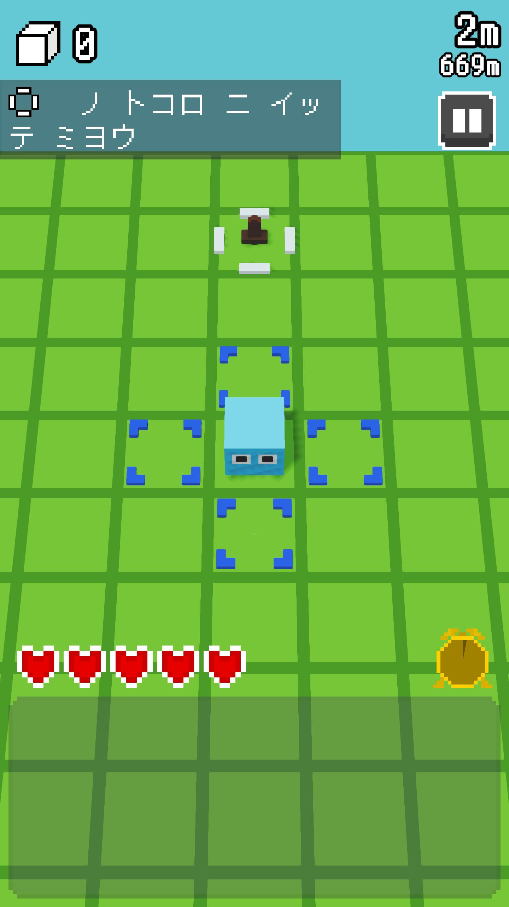
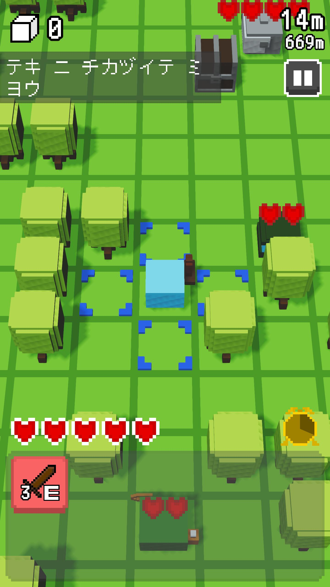
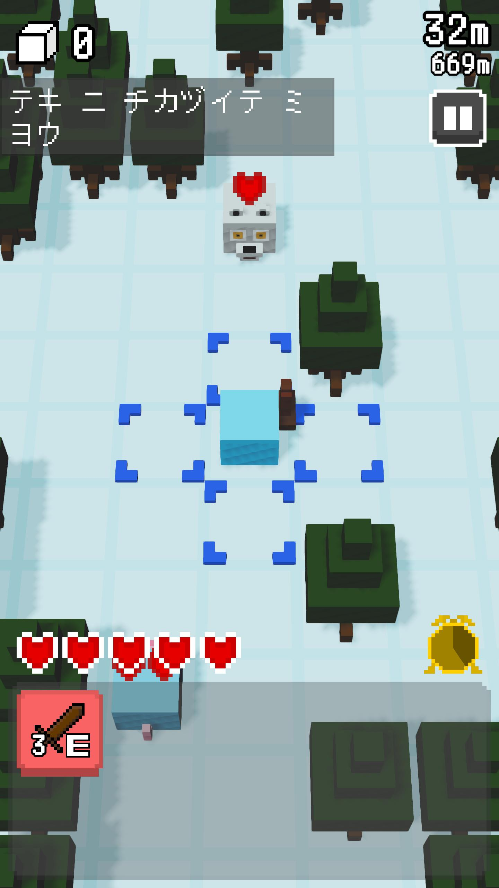

## Introduction

[BOOT CAMP](https://www.uozugame.com/) is a game creator training program run as part of the Tsukuru UOZU project, where professional creators mentor aspiring game developers.

As with the previous boot camp, I decided to take part again this year.

## Should I Make a New Game or Keep Working on the Same One?

The biggest question I had going into this boot camp was, **"What should I make?"**

"If I make a new game, I might be able to work on it with fresh energy and get a lot of advice."

When you make games, it is easy to be tempted by ideas like that, but I chose to keep working on the same game, _Treasure Rogue_.

After all, I am nowhere near satisfied with the current state of _Treasure Rogue_. I felt that **starting the next game while I still felt that way would be wrong**.

## Closing Thoughts

The goal of _Treasure Rogue_ is to become **the kind of game I keep coming back to and end up playing again and again**.

I want to reach that goal during this boot camp.
