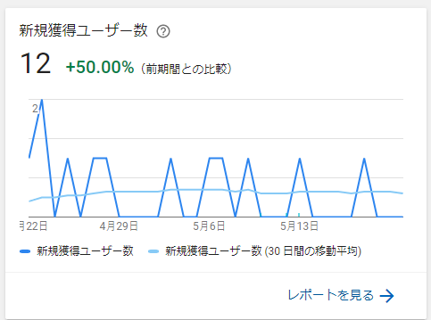

はじめまして、**Makihiro（[@makihiro\_dev](https://twitter.com/makihiro_dev)）**です。

この度、ホームページ兼ブログを開設しました！

## はじめに

僕は**「ゲームを作って食っていく」**ということを掲げています。

しかし、現実はなかなか厳しいです。

これは初めてリリースしたゲームの現在（リリースから約2か月）の新規獲得ユーザー数。

DAU（1日あたりのアクティブユーザー数）はだいたい１前後です。

これまでずっとゲームを完成させることばかり考えていましたが、ゲームをリリースして初めて「どうやって遊んでくれる人を増やすか」を考えるようになりました。

-   クオリティを上げるための工数
-   ゲームを知ってもらうためのお金と時間

そういったことを意識するようになって、

**「あ、これ時間かかるな」**って感じました。

なので、そこに至るまでの食い扶持を作る必要があります。

僕はこれまで就職を考えたことが無かったのですが、ここにきて初めて就職を考えるようになりました。（かの和尚先生も「自分のゲームが安定してから独立したほうがいい」みたいなことを言っていました）

そこでゲーム会社に就職するには何が必要かを調べるために求人を見ていると**「技術ブログあったら見るわ」**みたいなことが書いてあるのを見つけました。

そんなわけで、このブログを開設しました。

## おわりに

このブログは**毎日更新**するので、Twitterをフォローしてもらえると幸いです。

**Twitter: [@makihiro\_dev](https://twitter.com/makihiro_dev)**

これからよろしくお願いします。

* * *
