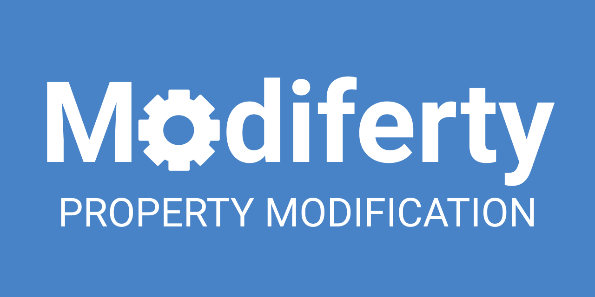

## はじめに

ゲームを作っていたら割といい感じのライブラリが出来上がったので、Githubにてライブラリ**[「Modiferty」](https://github.com/mackysoft/Modiferty)**を公開しました！

このライブラリは、キャラクターや武器に「ステータス」の概念があるようなゲームで広く導入できます。

Github: [https://github.com/mackysoft/Modiferty](https://github.com/mackysoft/Modiferty)

## Modifertyって何？

「Modiferty」はゲーム内のキャラクターや武器のステータスの変化を管理するのに優れています。

-   どのような変更が行われたか（値が2倍されたのか、+1されたのか、etc…）が把握できる。
-   複数回にわたるステータスの変更を管理できる。

これだけだと「？」となると思うので、具体的な例を紹介します。

## 能力値アップの実装

ゲームで「キャラクターの一時的な能力値アップを実装したい」という時、どうしますか？（ポケモンの「つるぎのまい」や、ドラクエの「バイキルト」とか）

僕が挙げられる方法は主に2つです。

1.  ステータスの値を上書き
2.  「攻撃力の倍率」みたいな変数を用意して、攻撃時に倍率を適用

### １．ステータスの値を上書き

```cs

using UnityEngine;

public class Character : MonoBehaviour {

	public int health = 3;
	public int attackPower = 2;

	// 攻撃処理
	public void Attack (Character target) {
		// 倍率を適用した攻撃力分のダメージを与える
		target.health -= attackPower;
	}

	// 攻撃力アップ
	public void PowerUp (int additionalAttackPower) {
		attackPower += additionalAttackPower;
	}
}
```

これは単純に、欠点が多いです。

-   どのようなステータス変化があったか分からないので、「初期の値から＋１されている」というような演出を行うことができない。
-   「足し算や掛け算が混合した変更」や「複雑な変更」が行われた場合の管理が困難。

### ２．「攻撃力の倍率」の変数を用意して、攻撃時に倍率を適用

```cs

using UnityEngine;
using System.Collections.Generic;

public class Character : MonoBehaviour {

	public int health = 3;
	public int attackPower = 2;

	// 倍率のリスト
	public List<float> attackPowerMultiply = new List<float>();

	// 攻撃処理
	public void Attack (Character target) {
		int multipiedAttackPower = attackPower;

		// 攻撃力に倍率を適用
		foreach (float multiply in attackPowerMultiply) {
			multipliesAttackPower *= multiply;
		}

		// 倍率を適用した攻撃力分のダメージを与える
		target.health -= multipliedAttackPower;
	}
}
```

この方法なら「どのようなステータス変化が起こるか」が把握できるので、それを利用した演出をすることが可能です。

しかし、この方法は掛け算しかできないので拡張性に乏しいです。

Modifiertyは、ここまで挙がった問題を解決できるライブラリです。

-   どのような変更が行われたか（値が2倍されたのか、+1されたのか、etc…）が把握できる。
-   複数回にわたるステータスの変更を管理できる。

## 具体的な実装例

ここでは攻撃力が変動するキャラクターの実装例を紹介します。

### １．ModifiablePropertyでattackPowerを宣言する

まずキャラクターの攻撃力などといった、「変動させたい数値」をintやfloatの代わりに**ModifiableProperty**を使って宣言しましょう。

```cs

using UnityEngine;
using MackySoft.Modiferty;

public class Character : MonoBehaviour {

	// baseValueは値の変動の基礎となる値
	public ModifiableInt attackPower = new ModifiableInt(baseValue: 2);

}
```

今回はintの代わりに、ModifiableIntを使います。（floatなら代わりにModifiableFloatを使用します）

これでキャラクターの攻撃力の変動を管理できるようになりました。

### ２．Modifierを追加する

次に「ぶつかったキャラクターの攻撃力を加算するアイテム」を作ってみます。

```cs

using UnityEngine;
using MackySoft.Modiferty;

public class PowerUpItem : MonoBehaviour {

	// amountは加算量
	public AdditiveModifierInt additiveAttackPower = new AdditiveModifierInt(amount: 1);

	void OnCollisionEnter (Collision collision) {
		Character target = collision.collider.GetComponentInParent<Character>();
		if (target != null) {
			// attackPower.Modifiersに、数値を+1するModifierを追加
			target.attackPower.Modifiers.Add(additiveAttackPower);
		}
	}
}
```

恐らくここで「そもそもAdditiveModifierIntってなんなんだ？」となると思います。

簡潔に言うとAdditiveModifierIntは、Modifertyで重要な概念となる**「Modifier」**の１つです。

例では、ModifierであるadditiveAttackPowerを、ぶつかったCharacterのattackPower.Modifiersに追加しているのが分かります。（削除もできます）

このModifierが、先ほど紹介した「倍率」と同じような役割を持っています。

この例ではAdditiveModifier（足し算）を使いましたが、四則演算分のModifierが揃っている他に、特殊な変更を行えるModifierも実装されています。([Modiferty – Modifier Types](https://github.com/mackysoft/Modiferty#modifier-types))

つまりModifertyは、**「値に対して複雑かつ複合的な処理を行い、それを管理できるライブラリ」**と言えます。

### ３．attackPowerにModifierを適用する

次に「キャラクターが攻撃を行う処理」を書きます。

```cs

using UnityEngine;
using MackySoft.Modiferty;

public class Character : MonoBehaviour {

	public int health = 3;

	// baseValueは値の変動の基礎となる値
	public ModifiableInt attackPower = new ModifiableInt(baseValue: 2);

	public void Attack (Character target) {
		target.health -= attackPower.Evaluate();
	}

}
```

重要なのが、**attackPower.Evaluate()**です。

Evaluate関数はModifiableInt（及びModifiableProperty）に実装されている関数で、**「自身に追加されている全てのModifierを、基礎値（baseValue）に適用する」**ということをやっています。

先ほど紹介した「倍率リストを適用する処理」をイメージしてもらえれば分かりやすいと思います。

なので、もし仮に

-   attackPowerの基礎値が２
-   attackPowerに「加算量が１のAdditiveModifier」が追加されている

という状態でattackPower.Evaluate()を実行すると、

**「２（baseValue）＋１（AdditiveModifier）」**なので返される値は「３」になります。

* * *

これで、Modifertyを使った実装は完了です。

## おわりに

このライブラリはMITライセンスなので、かなり自由に使えます。

実際に僕のゲームでも使用していて、基本的には

-   ModifiablePropertyで値の宣言をする
-   値の変更を行う時はModifierを使う

だけで簡単に導入できるので、「使えそう」と思ったら試してみてください。

[](https://github.com/mackysoft/Modiferty)

Github: [https://github.com/mackysoft/Modiferty](https://github.com/mackysoft/Modiferty)
