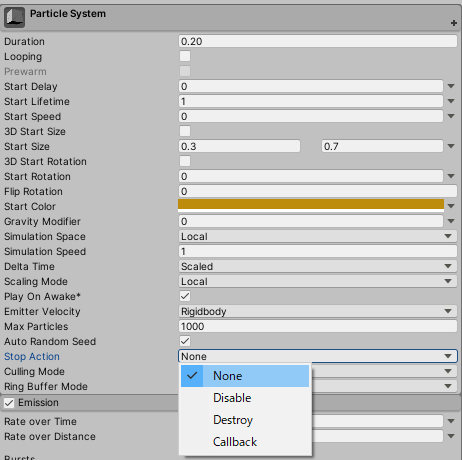

## はじめに

「ParticleSystemの終了判定ってどうやるんだろう？」ということを調べたので、詳しく解説します。

## 終了判定はStopActionから行える

ParticleSystemが終了ときに処理を行うには、ParticleSystemのメインモジュールのStopActionを設定する必要があります。



| StopAction | 説明 |
| --- | --- |
| None | 何もしない |
| Disable | 終了時にParticleSystemのゲームオブジェクトを非アクティブにする |
| Destroy | 終了時にParticleSystemのゲームオブジェクトを破壊する |
| Callback | 終了時にParticleSystemのゲームオブジェクトにアタッチされたMonoBehaviourのOnParticleSystemStoppedコールバックを呼ぶ（下の方で詳しく解説） |

### 終了判定の基準

これらの終了時の処理が行われるには、以下の基準を満たす必要があります。

-   ParticleSystem内の全てのパーティクルが消滅している
-   新しいパーティクルが生成されない（Loopingがtrueだったりするとダメ）

## OnParticleSystemStopped

StopAction.Callbackを使用することで、より細かな終了判定を行うことができます。

MonoBehaviourのコールバックの一つである**OnParticleSystemStopped**を使用します。

以下のコードは、OnParticleSystemStoppedの使用例です。

```cs

using UnityEngine;

[RequireComponent(typeof(ParticleSystem))]
public class StoppedScript : MonoBehaviour {

	void Start () {
		var main = GetComponent<ParticleSystem>().main;

		// StopActionはCallbackに設定している必要がある
		main.stopAction = ParticleSystemStopAction.Callback;
	}

	void OnParticleSystemStopped () {
		Debug.Log("System has stopped!");
	}

}
```

このコンポーネントをParticleSystemと一緒のゲームオブジェクトにアタッチすることで、OnParticleSystemStopped内の処理が呼ばれます。

## 参考

-   [Scripting API: MonoBehaviour.OnParticleSystemStopped](https://docs.unity3d.com/ScriptReference/MonoBehaviour.OnParticleSystemStopped.html)
