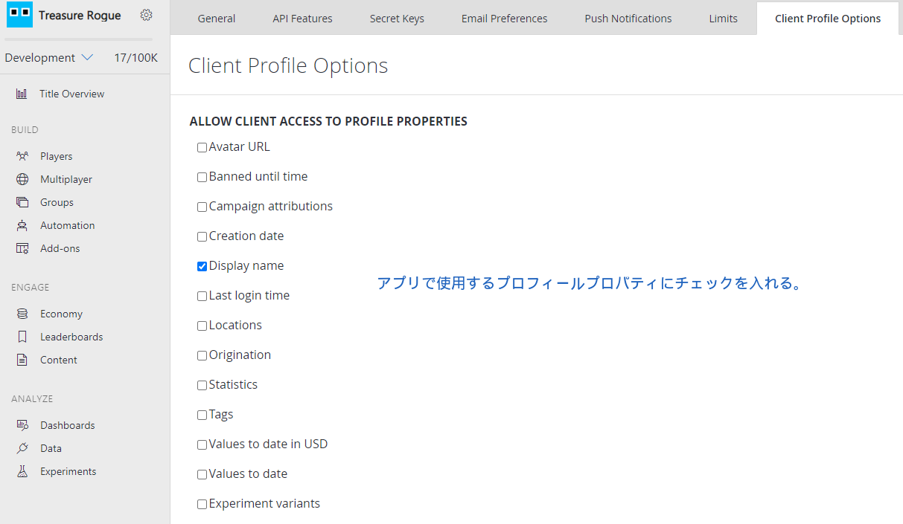

この記事でのバージョン

-   PlayFab SDK: 2.86.2005 18

## はじめに

この記事で紹介する機能では、前提条件としてプレイヤーがログインしている必要があるので、ログインについて知りたい方は以下の記事を見てもらえると幸いです。

[【PlayFab】IDの生成、ログインについて【Unity】](/playfab-login/)

## プロフィールへのアクセスを許可する

まずは、PlayFabのAPIからプロフィールにアクセスするための許可を設定する必要があります。

[PlayFabの管理画面](https://developer.playfab.com/en-US/my-games)を開きましょう。次に「歯車アイコン->Title settings」から設定画面を開き、「Client Profile Options」を選択します。

そしたら「ALLOW CLIENT ACCESS TO PROPERTIES」下にある、アプリからアクセスしたいプロフィールプロパティのトグルにチェックを入れます。

今回はDisplayNameにアクセスしたいので「DisplayName」のトグルにチェックを入れました。



## DisplayNameを設定する

今回はDisplayNameを取得したいので、まずはDisplayNameを設定しましょう。

```cs

using UnityEngine;
using PlayFab;
using PlayFab.ClientModels;

public void SetPlayerDisplayName (string displayName) {
	PlayFabClientAPI.UpdateUserTitleDisplayName(
		new UpdateUserTitleDisplayNameRequest {
			DisplayName = displayName
		},
		result => {
			Debug.Log("Set display name was succeeded.);
		},
		error => {
			Debug.LogError(error.GenerateErrorReport());
		}
	);
}
```

## プロフィールを取得する

プロフィールを取得するには、**GetPlayerProfile関数**を使用します。

```cs

using UnityEngine;
using PlayFab;
using PlayFab.ClientModels;

public void GetDisplayName (string playfabId) {
	PlayFabClientAPI.GetPlayerProfile(
		new GetPlayerProfileRequest {
			PlayFabId = playFabId,
			ProfileConstraints = new PlayerProfileViewConstraints {
				ShowDisplayName = true
			}
		},
		result => {
			string displayName = result.PlayerProfile.DisplayName;
			Debug.Log($"DisplayName: {displayName}");
		},
		error => {
			Debug.LogError(error.GenerateErrorReport());
		}
	);
}
```

### PlayFabId

どのプレイヤーのプロフィールを取得するかを指定します。

PlayFabIdは、PlayFabにおいてプレイヤーを識別するためのIdです。

詳しくは以下の記事に書いてあるので、詳しく知りたい方はお読みください。

[【PlayFab】PlayFabAuthenticationContextとは？【Unity】](/playfab-authenticationcontext/)

### PlayerProfileViewConstraints

どのプロフィールプロパティを取得するかを指定します。

PlayerProfileViewConstraintsには「Show○○」から始まるbool型のメンバが複数あるので、取得したい全てのプロパティの「Show○○」にtrueをセットしてください。

例えば「DisplayName」「AvaterURL」「LastLoginTime」を取得したいのなら、以下のように記述します。

```cs

ProfileConstraints = new PlayerProfileViewConstraints {
	ShowDisplayName = true,
	ShowAvatarUrl = true,
	ShowLastLoginTime = true
}
```

## おわりに

PlayFabに関して、筆者は現時点でプロジェクトに導入途中（勉強中）の段階です。

もし誤りがあれば教えてもらえると幸いです。

## 参考

-   [プレイヤープロファイルの取得](https://docs.microsoft.com/ja-jp/gaming/playfab/features/data/playerdata/getting-player-profiles)
