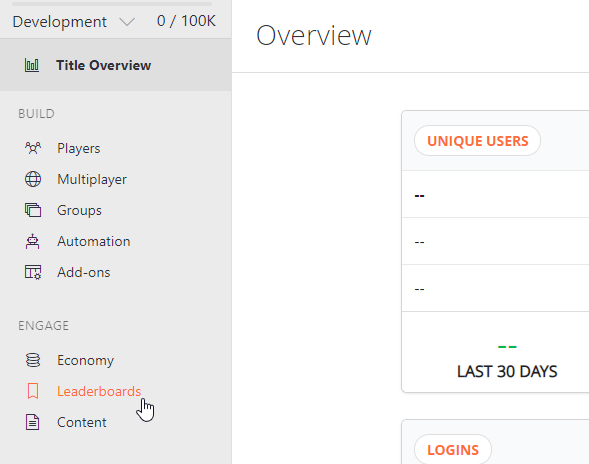
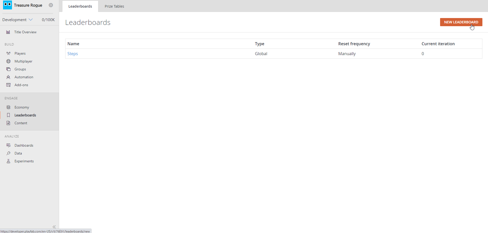
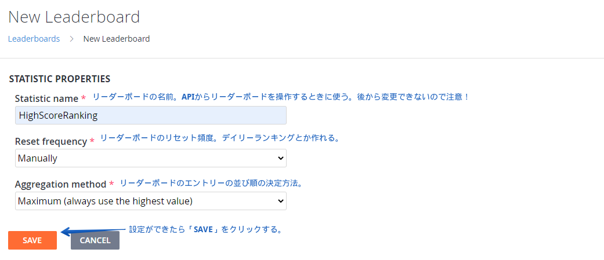
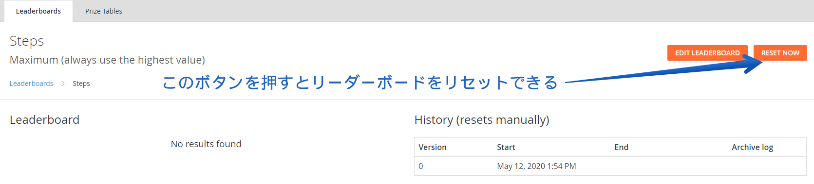
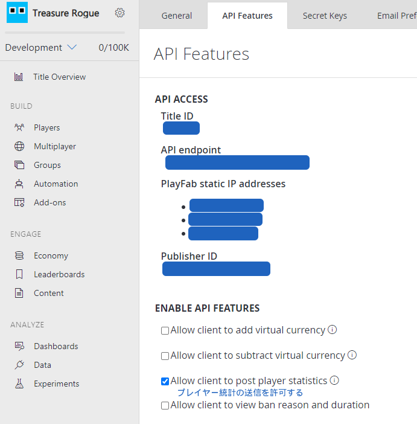

Version used in this article

-   PlayFab SDK: 2.86.2005 18

## Introduction

This article uses PlayFab's leaderboard-related APIs. Since players need to be logged in first, please see the following article if you want to learn about login.

[PlayFab: Generating an ID and Logging In [Unity]](/articles/playfab-login/)

## Creating a Leaderboard

To implement a leaderboard, you first need to create one from the PlayFab dashboard.

#### 1. Open the leaderboard management screen



#### 2. Click the "NEW LEADERBOARD" button in the upper right



#### 3. Create the leaderboard



#### Reset frequency

There are two broad reset modes: manual and scheduled. In manual mode, you reset the leaderboard directly from the leaderboard management screen.



Even if you choose a scheduled reset, you can still reset it manually from here.

#### Aggregation method

This determines how the values sent to the leaderboard are aggregated.

| Aggregation method | Description |
| --- | --- |
| Last | Uses the last value submitted by the player. |
| Minimum | Uses the lowest value. Suitable for rankings that compete for the lowest score. |
| Maximum | Uses the highest value. Suitable for rankings that compete for the highest score. |
| Sum | Adds the value submitted by the player to the existing value. Suitable for rankings that compete on the total. |

## Scripting

Here I will explain the leaderboard APIs.

### Registering the player's name

Set the player name to display on the leaderboard.

```cs

using UnityEngine;
using PlayFab;
using PlayFab.ClientModels;

public void SetPlayerDisplayName (string displayName) {
	PlayFabClientAPI.UpdateUserTitleDisplayName(
		new UpdateUserTitleDisplayNameRequest {
			DisplayName = displayName
		},
		result => {
			Debug.Log("Set display name was succeeded.);
		},
		error => {
			Debug.LogError(error.GenerateErrorReport());
		}
	);
}
```

### Submitting a score to the leaderboard

Before you can submit a player's score, you first need to allow player statistics submission in the PlayFab dashboard.

From the gear icon -> Title settings, open API Features and check "Allow client to post player statistics."



The following code is a sample for submitting a player's score to the leaderboard.

```cs

using UnityEngine;
using PlayFab;
using PlayFab.ClientModels;

public void SendStatisticUpdate (string leaderboardName,int score) {
	// The update information you want to send
	var statisticUpdates = new List<StatisticUpdate> {
		new StatisticUpdate {
			StatisticName = leaderboardName,
			Value = score
		}
	};

	PlayFabClientAPI.UpdatePlayerStatistics(
		new UpdatePlayerStatisticsRequest {
			Statistics = statisticUpdates
		},
		result => {
			Debug.Log("Send score was succeeded.");
		},
		error => {
			Debug.LogError(error.GenerateErrorReport());
		}
	);
}
```

Specify, for `leaderboardName`, the name you decided on when you created the leaderboard earlier (`Statistic name`).

### Retrieving the leaderboard

The following code is a sample for retrieving the leaderboard.

```cs

using UnityEngine;
using PlayFab;
using PlayFab.ClientModels;

public void LoadLeaderboardWithStartAtSpecifiedPosition (string leaderboardName,int startPosition,int maxResultsCount) {
	PlayFabClientAPI.GetLeaderboard(
		new GetLeaderboardRequest {
			StatisticName = leaderboardName,
			StartPosition = startPosition,
			MaxResultsCount = maxResultsCount
		},
		result => {
			// Display the leaderboard results in the log
			foreach (PlayerLeaderboardEntry entry in result.Leaderboard) {
				Debug.Log($"{entry.DisplayName}: {entry.StatValue}");
			}
		},
		error => {
			Debug.LogError(error.GenerateErrorReport());
		}
	);
}
```

#### Types of GetLeaderboard

There are several ways to retrieve leaderboard data.

| GetLeaderboard type | Description |
| --- | --- |
| [GetLeaderboard](https://docs.microsoft.com/en-us/rest/api/playfab/client/player-data-management/getleaderboard?view=playfab-rest) | Retrieves a list of users from a specified position in the leaderboard, for the specified number of users. (There is also GetFriendLeaderboard, which is limited to friends.) |
| [GetLeaderboardAroundPlayer](https://docs.microsoft.com/en-us/rest/api/playfab/client/player-data-management/getleaderboardaroundplayer?view=playfab-rest) | Retrieves a ranked list of users centered on the currently logged-in player, or a specified player. (There is also GetFriendLeaderboardAroundPlayer, which is limited to friends.) |

## Closing thoughts

I am still in the middle of introducing PlayFab into a project, so I am still learning.

If you spot any mistakes, I would appreciate it if you let me know.

## References

-   [Using the Profile for Advanced Scoreboards](https://docs.microsoft.com/ja-jp/gaming/playfab/features/social/tournaments-leaderboards/using-the-profile-for-advanced-leaderboards)
-   [I tried PlayFab's convenient leaderboard feature and even handed out ranking rewards](https://qiita.com/_y_minami/items/9143502f465ad11ff2ca)
