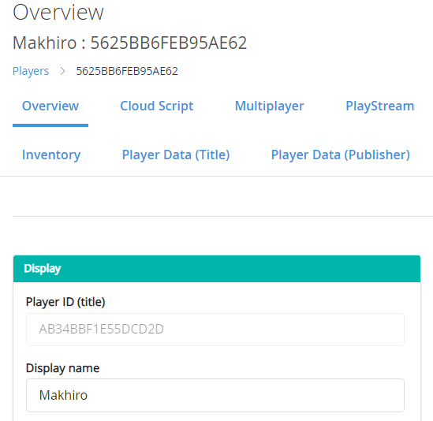
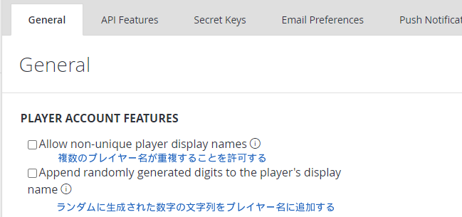

Version used in this article

-   PlayFab SDK: 2.86.2005 18

## Introduction

Since players need to be logged in first, please see the following article if you want to learn about login.

[PlayFab: Generating IDs and Logging In [Unity]](/articles/playfab-login/)

## Registering and Updating the Player Display Name

**With the player logged in**, you can register or update the player's name by calling `UpdateUserTitleDisplayName` as shown below.

```cs

using UnityEngine;
using PlayFab;
using PlayFab.ClientModels;

public void SetPlayerDisplayName (string displayName) {
	PlayFabClientAPI.UpdateUserTitleDisplayName(
		new UpdateUserTitleDisplayNameRequest {
			DisplayName = displayName
		},
		result => {
			Debug.Log("Display name was set successfully.");
		},
		error => {
			Debug.LogError(error.GenerateErrorReport());
		}
	);
}
```

If you check the player in the PlayFab dashboard, you can see that the registered `DisplayName` is shown there.



## Allowing duplicate player names

In PlayFab, player names are generally not allowed to be duplicated. If you try to register a duplicate name, you will get an error.

However, you can allow non-unique names from the PlayFab dashboard.

Open `Title settings` from the gear icon in the PlayFab dashboard. You should see the screen below, and if you want to allow duplicate names, check the box.



## References

-   [Account Management – Update User Title Display Name](https://docs.microsoft.com/en-us/rest/api/playfab/client/account-management/updateusertitledisplayname?view=playfab-rest)

## Closing Thoughts

Registering a player name is surprisingly easy.
