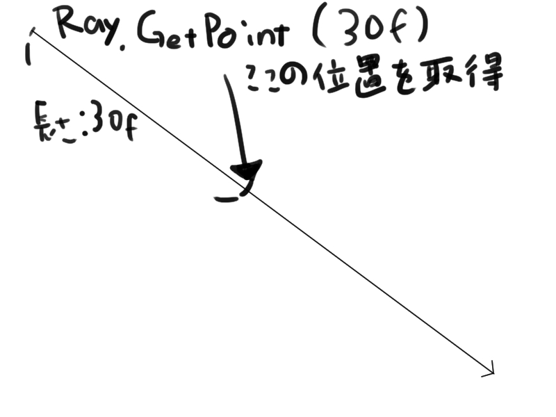

## はじめに

RayはUnityにおける仮想の光線です。

```cs

using UnityEngine;

public class RayExample : MonoBehaviour {

	public Transform target;

	void Update () {
		// 自分の位置からターゲットに向けた、仮想の光線を生成
		Ray ray = new Ray(
			origin: transform.position, // 原点
			direction: target.position - transform.position // 方向
		);
		Debug.DrawRay(ray.origin,ray.direction * 10f);
	}
}
```

## 便利な関数

Rayを扱う上で便利な関数を紹介します。

### Physics.Raycast 系関数

RaycastはRayを照射して「コライダーと接触したか」「コライダーと接触した時の様々な情報」を取得することができます。

```cs

using UnityEngine;

public class RayExample : MonoBehaviour {

	public Transform target;
	public float distance;
	public LayerMask layerMask;
	public QueryTriggerInteraction queryTriggerInteraction;

	void Update () {
		// 自分の位置からターゲットに向けた、仮想の光線を生成
		Ray ray = new Ray(
			origin: transform.position, // 原点
			direction: target.position - transform.position // 方向
		);

		// Rayがターゲットのコライダーに接触したかどうかをチェックする
		if (Physics.Raycast(ray,out RaycastHit result,distance,layerMask,queryTriggerInteraction)) {
			// 接触した時の様々な情報はresultに格納されている
			Debug.Log("Hit: " + result.collider.name);
		}
		Debug.DrawRay(ray.origin,ray.direction * 10f);
	}
}
```

### Camera.ScreenPointToRay (Vector3 position)

カメラからpositionに向けてのRayを生成します。

```cs

using UnityEngine;

public class RayExample : MonoBehaviour {

	public Transform target;

	void Update () {
		// メインカメラからターゲットに向けたRayを生成
		Ray ray = Camera.main.ScreenPointToRay(target.position);

		Debug.DrawLine(ray.origin,target.position);
	}
}
```

### Ray.GetPoint (float distance)

Rayのある距離の時点での位置を取得できます。

```cs

using UnityEngine;

public class RayExample : MonoBehaviour {

	public Transform target;
	public float distance;

	void Update () {
		// 自分の位置からターゲットに向けた、仮想の光線を生成
		Ray ray = new Ray(
			origin: transform.position, // 原点
			direction: target.position - transform.position // 方向
		);

		Vector3 point = ray.GetPoint(distance);

		Debug.Log(point);
	}
}
```



## 参考

-   [Scripting API: Ray](https://docs.unity3d.com/ScriptReference/Ray.html)
-   [Scripting API: Physics.Raycast](https://docs.unity3d.com/ScriptReference/Physics.Raycast.html)
