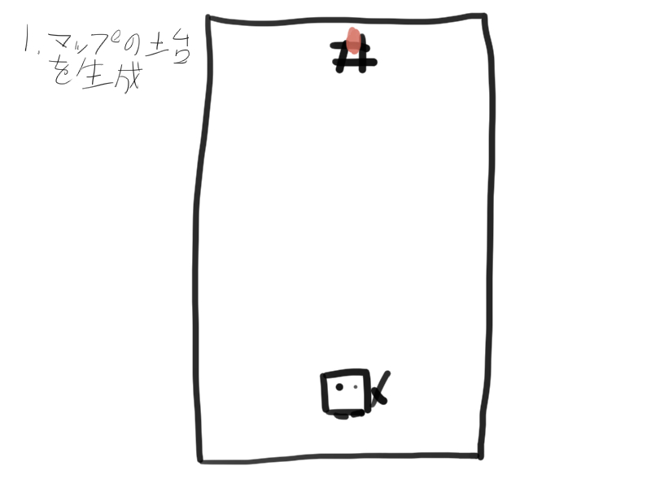
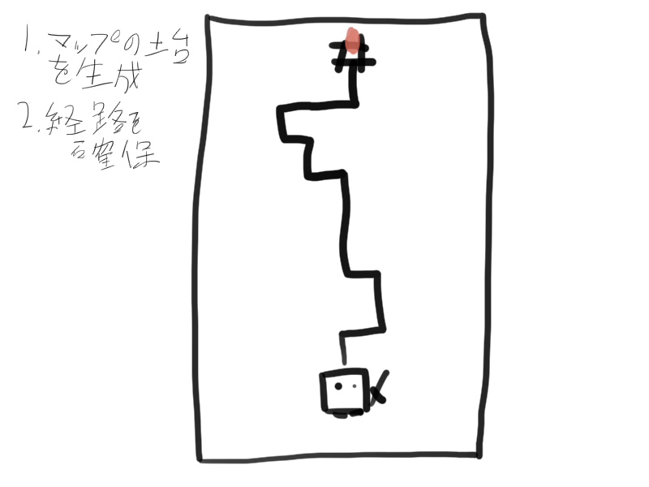
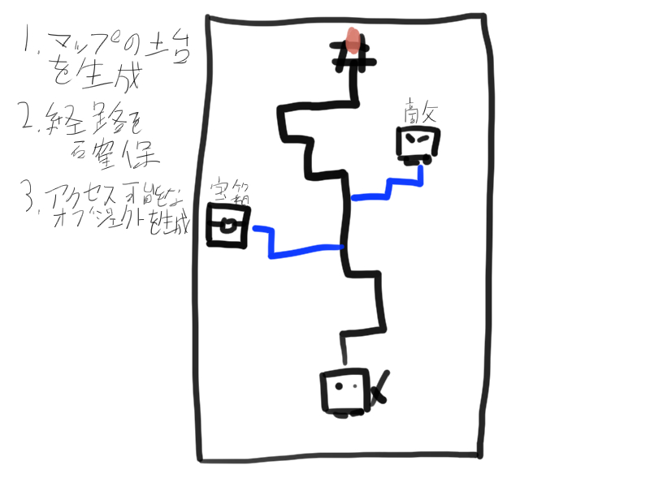
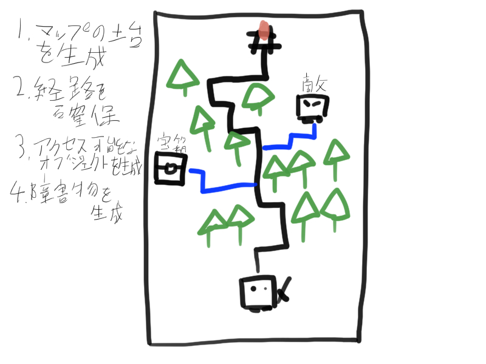

## Introduction

[Treasure Rogue](/games/treasure-rogue/) is a roguelike game I made, and this article explains the map generation algorithm I implemented for it.

Treasure Rogue generates tall, vertically oriented maps, but the basic implementation should also work for Mystery Dungeon-style map generation.

## Basic Map Generation Implementation

Before we look at the concrete implementation, let us first check the rough flow of the process.

### ILevelProcessor

The `ILevelProcessor` interface is implemented by classes that perform work during map generation, such as spawning objects on the map.

```cs

public interface ILevelProcessor {

	// Perform some asynchronous processing on the field
	IEnumerator Process (IField field);

}
```

I will explain concrete `ILevelProcessor` implementations later.

### The process that generates the map

By looping through the collection of `ILevelProcessor`s and calling `Process` in order, the system performs work such as object spawning.

```cs

public class Field : IField {

	// omitted

	// Function that generates the map
	IEnumerator GenerateInternal () {
		m_IsGenerating.Value = true;

		yield return GenerateField();

		foreach (ILevelProcessor processor in Processors) {
			yield return processor.Process(this);
		}

		m_IsGenerating.Value = false;
	}
}
```

## Specific Implementation

Now that we have a rough idea of what the system does, let us look at the actual implementation.

### 1. Generate the map base

First, generate the map base.



### 2. Secure a path

If objects are placed randomly, the system may generate a map that the player cannot traverse, so first decide where objects must not be spawned.



#### Actual code

```cs

[SerializeField]
public class SecurePathProcessor : ILevelProcessor {

	public static SecurePathProcessor Instance { get; } = new SecurePathProcessor();

	public IEnumerator Process (IField field) {
		yield return FieldManager.Instance.GraphUpdate();
		yield return field.SecurePath(to: new Vector3Int(
			Random.Range(0,field.Bounds.size.x),
			0,
			field.Bounds.zMax
		));
	}
}
```

`SecurePathProcessor` implements `ILevelProcessor`. That means `Process` is called in the map generation loop.

`SecurePath` generates a random path from the player registered in the field to the specified position, and prevents objects from being spawned along that path.

### 3. Generate accessible objects

All that remains is to generate the "accessible objects" such as enemies and treasure chests, and obstacles. We start with the accessible objects.

We need to secure paths to the accessible objects before generating obstacles.



#### Actual code

```cs

[Serializable]
public class MultiSpawnLevelBuilder : ILevelProcessor {

	// If too many objects are spawned, the path-securing process (pathfinding) becomes too heavy and freezes the game.
	// So when the number of generated objects exceeds 10, the system does not secure paths.
	const int k_SecurePathAcceptableQuantity = 10;

	[SerializeField]
	FieldObject m_Prefab;

	[SerializeField]
	FieldObjectQuantitiy m_Quantity = new FieldObjectQuantitiy(1);

	[SerializeField]
	bool m_SecurePath;

	public IEnumerator Process (IField field) {
		// The object spawning and path-securing process
		// is long, so it is omitted here.
	}
}
```

`MultiSpawnLevelBuilder` also implements `ILevelProcessor`.

### 4. Generate obstacles

Finally, generate obstacles. No obstacles are spawned on the secured path.



The same code is used as in "Generate accessible objects." However, path securing is not performed because these are obstacles.

## Closing Thoughts

That is the basic flow of the map generation algorithm used in _Treasure Rogue_.

If you swap out each `ILevelProcessor` to match the objects you want to place and the rules of your game, you can reuse the same structure for many kinds of map generation.
