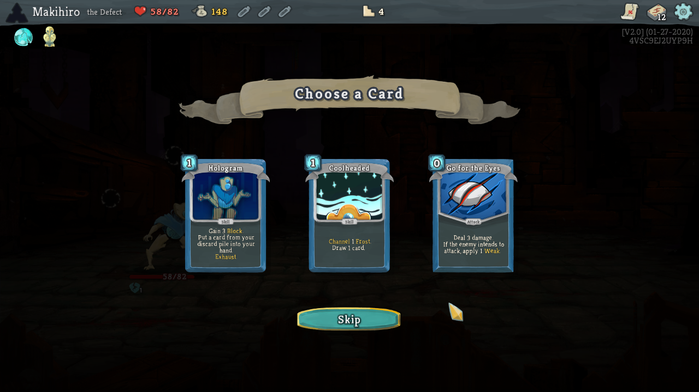
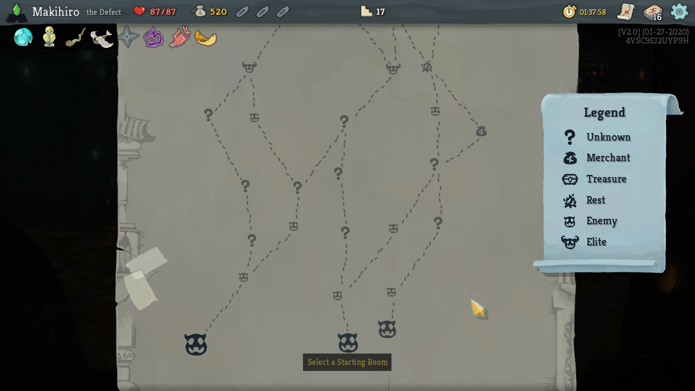
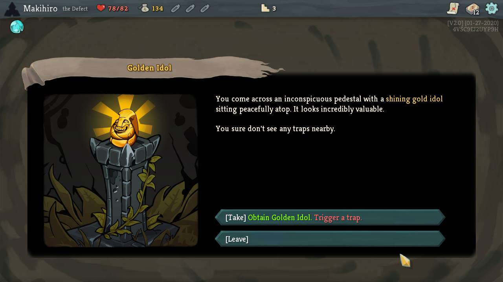
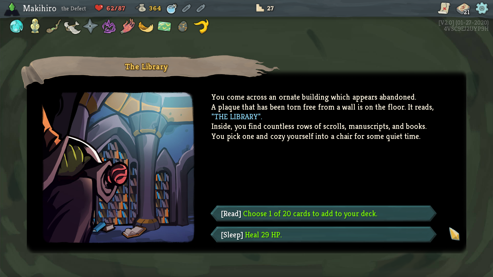
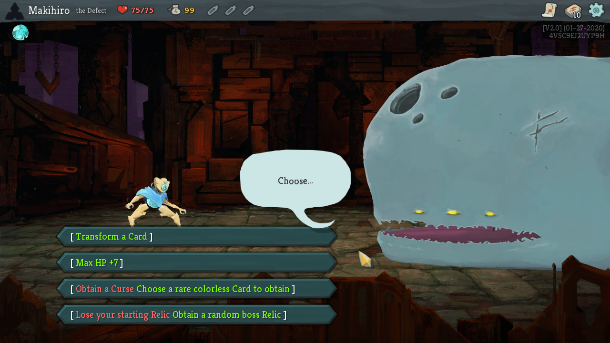
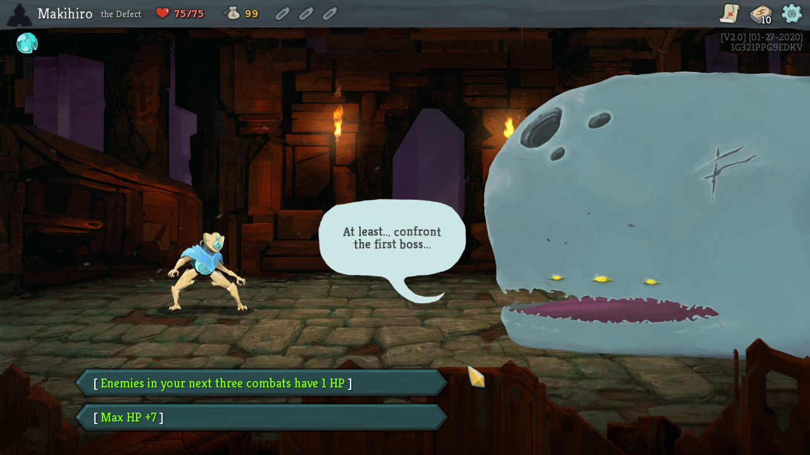

## 前言

《Slay the Spire》是一款 Roguelike 牌組構築卡牌遊戲。

而我自己也正在製作 Roguelike 遊戲，所以這篇文章會從 Roguelike 開發者的視角，來思考《Slay the Spire》這款作品。

## 《Slay the Spire》的隨機性

當你長時間玩同一款遊戲時，很容易進入一種「沒有太多情緒起伏、像流水作業一樣的遊玩狀態」，接著不禁心想：「我到底在幹嘛……？」

**但這款遊戲裡，幾乎不存在那種流水作業感。**

因為它包含了大量隨機要素，玩家必須隨時思考並不斷做出選擇。

而在這些隨機性之中，尤其重要的有以下四個部分：

-   牌組構築
-   關卡路線
-   事件
-   開局選項

### 牌組構築

打倒敵人之後，或是在遊戲中的某些事件裡，你都會獲得拿到卡牌的機會。

你必須對照目前的牌組構成來選牌。（當然也可以選擇不拿）

由於出現的卡牌是隨機的，因此根本不存在所謂的 **「固定模板牌組」**。

也正因為沒有模板牌組，這款遊戲才能讓人一直享受無窮無盡的試錯與調整。

#### 一期一會的牌組

偶爾你會組出一副讓人忍不住覺得「這根本是最強牌組吧！」的構成。

但只要打倒最終 Boss，一切就結束了。你再也不會組出一模一樣的那副牌組。

忘掉過去那副最強的牌組，繼續尋找下一副最強牌組，我認為這種 **「一期一會」** 的體驗，正是這款遊戲的魅力之一。

### 關卡路線

這款遊戲會讓你攻略總共由四層組成的關卡，而每一層的路線配置都是隨機生成的，所以你每次都得重新思考自己要走哪一條路。

關卡上的各種節點大致如下：

<table><tbody><tr><td>Unknown</td><td>可能會發生某種事件。</td></tr><tr><td>Merchant</td><td>商人。可以購買卡牌等物品。商品內容是隨機的。</td></tr><tr><td>Treasure</td><td>寶箱。可以獲得金錢、卡牌與強化道具。得到的內容是隨機的。</td></tr><tr><td>Rest</td><td>可以回復 HP，或升級一張卡牌。（二選一）</td></tr><tr><td>Enemy</td><td>普通敵人。打倒後可以獲得獎勵。出現的敵人是隨機的。</td></tr><tr><td>Elite</td><td>精英敵人。戰鬥風險較高，但打贏後的報酬更好。出現的敵人是隨機的。</td></tr></tbody></table>

你會一邊思考「該在哪裡遇到商人？」「要不要打精英敵人？」之類的問題，一邊決定自己的路線。

關卡的各種要素幾乎都帶有隨機性，而其中最值得注意的，就是 **「？」格（Unknown）**。

### 事件

當你停在「？」格上時，高機率會觸發事件。（不過偶爾也可能遇到敵人，或直接碰到商人）

而這些事件，正是最能替遊戲帶來隨機性的部分。

從 [Wiki](https://slay-the-spire.fandom.com/wiki/Events) 來看，目前共有 52 種事件，但整體而言，幾乎沒有那種 **「玩家單方面吃虧」** 的事件。

-   像是「升級一張卡牌」這種單純就是賺到的事件
-   必須在「承擔風險換取報酬」與「沒有風險，但也沒有報酬或只有極小報酬」之間做選擇的事件

既正向又不知道會發生什麼的「？」格，會讓人非常期待。

而玩家也會因此更積極地主動走向「？」格，最後不斷重複這種高隨機性的體驗，漸漸沉迷在《Slay the Spire》之中。

### 開局選項

在《Slay the Spire》的每一場遊戲開頭，都會有一隻像鯨魚的生物逼你做出選擇。

舉幾個選項例子來說：

-   增加最大 HP
-   將起始牌組中的一張卡「移除」「變成其他卡」或「升級」
-   隨機獲得一張稀有卡
-   以拿到 Curse（詛咒）卡為代價，換取「從稀有卡中選一張獲得」或「獲得 Relic（強化玩家的道具）」

**這個開局選項，對於維持遊戲前期的動力有著極其重要的作用。**

這款遊戲的初始牌組是固定的，所以最開頭很容易變成差不多的遊玩流程。透過一開始就給你 **「隨機的選擇」**，遊戲成功拉高了玩家的興奮感。

#### 對某種選項組合的疑問

有一點我一直很好奇，就是開局選項裡存在一種「不太有趣的選項組合」。

-   前三場戰鬥中敵人的 HP 變成 1
-   最大 HP 增加 7

和那些能改變牌組的選項相比，這兩個選項顯得相當平淡。無論選哪個都不太有戲，所以每次出現這種組合時，我的動力都會明顯下降。（以體感來說，這種組合大概有 30% 到 50% 的機率會出現）

只有這一點，會讓我忍不住想：「開發者為什麼要做出這種組合？」

#### 或許是為了製造對比？

其中一種可能的解釋，是它的存在 **是為了製造對比**。

所謂的「對比」，就是有明顯的起伏。正因為存在這種不太有趣的組合，真正有趣的選項才會讓人更加期待，於是 **玩家就會忍不住一再按下 Play 按鈕**。我認為這是一種可能的設計思路。（參考：[遊戲變得有趣的「對比」【遊戲設計】](/articles/gamedesign-contrast-cedec2018/)）

## 玩家會一直被迫做選擇

以上就是四個重要的隨機來源。

在這款遊戲裡，每一局你都得不斷思考並做出選擇，例如「要拿哪張卡？」「要走哪條路？」「這個選項該怎麼選？」。

說 **「這款遊戲幾乎沒有不需要做選擇的時刻」**，我認為一點也不誇張。

總結來說，

**這款遊戲的樂趣，就在於思考並做出選擇的過程；而散落在各處的隨機性，就是讓這個過程每次都保持新鮮的機制。**

## 結語

如果你因此產生興趣，不妨親自玩玩看。

[https://store.steampowered.com/widget/646570/](https://store.steampowered.com/widget/646570/)

為了準備本文用到的參考圖片，我邊玩邊截圖，結果一不小心玩得太投入，整篇文章竟然花了三天才寫完。

## 參考資料

-   [專訪經典獨立遊戲《Slay the Spire》開發者：平衡調整的奧妙。「玩家該如何適應眼前被給予的條件？」讓玩家面對一期一會的戰術局面](https://news.denfaminicogamer.jp/interview/200117b)
-   [Slay the Spire - Wiki](https://slay-the-spire.fandom.com/wiki/Slay_the_Spire_Wiki)
