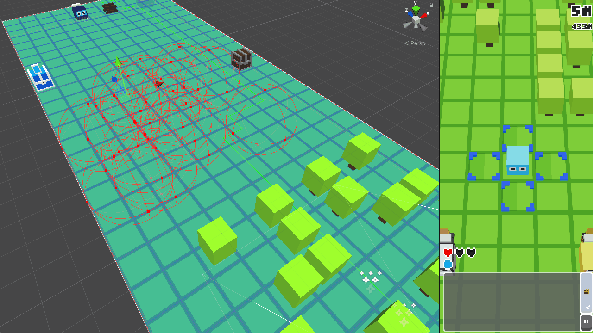
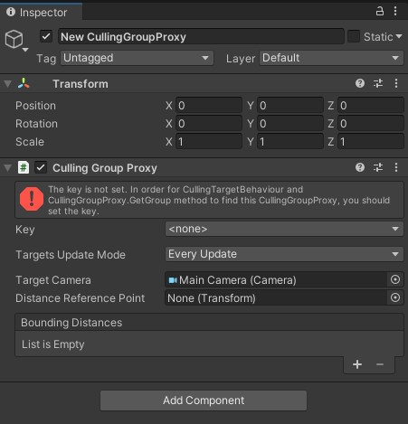
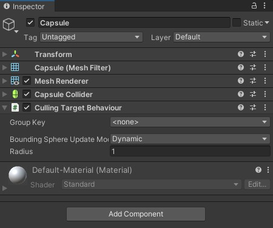
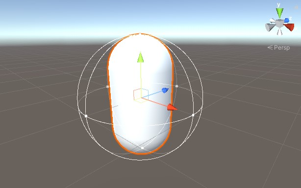
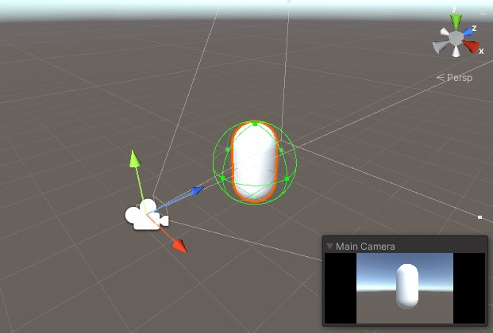
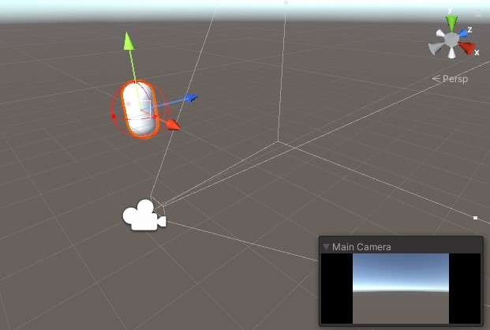
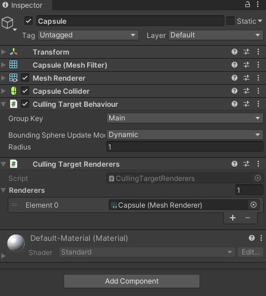

## CullingGroup API란?

오브젝트가 보이는지 여부나 플레이어와의 거리에 따라 동작을 바꾸고 싶을 때 유용합니다.

예를 들면:

-   카메라에 보이지 않는 오브젝트를 비활성화한다.
-   멀리 떨어진 캐릭터의 AI 처리를 건너뛴다.
-   생성 지점이 카메라에 보이는 동안에는 적이 생성되지 않도록 한다.

[Unity Manual](https://docs.unity3d.com/Manual/CullingGroupAPI.html)

## Vision이란?

CullingGroup은 훌륭한 기능이지만, 스크립트에서만 접근할 수 있고 사용법도 약간 까다롭기 때문에 바로 가져다 쓰기 쉬운 기능은 아닙니다.

[Vision](https://github.com/mackysoft/Vision)은 누구나 CullingGroup을 쉽게 사용할 수 있게 해 주는 라이브러리입니다.

#### Vision의 특징

-   CullingGroup을 쉽게 다룰 수 있게 해 주는 컴포넌트
-   직관적인 시각 편집기
-   높은 성능

아래 영상은 Vision으로 카메라에 보이지 않는 오브젝트를 비활성화하는 예시입니다.



코드를 작성하지 않고도 이 기능을 구현할 수 있습니다.

## 설치

GitHub 저장소에서 Vision의 최신 버전을 다운로드할 수 있습니다.

Releases: [https://github.com/mackysoft/Vision/releases](https://github.com/mackysoft/Vision/releases)

## 사용법

### 1. Culling Group Proxy 만들기

먼저 Vision의 기반이 되는 `CullingGroupProxy`를 만듭니다.

#### "Tools/Vision/Create New CullingGroupProxy" 메뉴를 선택하기

아래와 같은 GameObject가 생성됩니다.



#### 생성된 CullingGroupProxy에 키 지정하기

처음에는 키가 지정되지 않았다는 오류가 표시되므로, 키를 지정합니다.

기본값으로는 `Main` 키를 사용할 수 있습니다.

### 2. Culling Target Behaviour 추가하기

#### "Component/MackySoft/Vision/Culling Target Behaviour" 메뉴에서 추가하기

CullingTargetBehaviour는 다음과 같은 오브젝트에 붙입니다.

-   카메라에 보이지 않을 때 비활성화하고 싶은 오브젝트
-   플레이어와 멀어지면 AI를 실행하지 않아도 되는 캐릭터



#### 구체 반경 조정하기

CullingTargetBehaviour가 붙은 오브젝트에는 아래와 같은 구체(Bounding Sphere)가 표시됩니다.



이 구체는 오브젝트가 카메라에 보이는지, 그리고 플레이어와 얼마나 떨어져 있는지를 계산하는 데 필요합니다.

따라서 구체가 오브젝트 전체를 완전히 감싸도록 맞춰야 합니다.

아래 그림처럼, 구체의 색은 카메라에 보이는지 여부에 따라 바뀝니다.





#### 키 지정하기

CullingTargetBehaviour의 GroupKey는 같은 키를 가진 CullingGroupProxy를 찾는 데 사용됩니다. CullingTargetBehaviour가 시작되면 같은 키를 가진 CullingGroupProxy에 자신을 등록합니다.

#### Bounding Sphere Update Mode 설정하기

이 값은 성능에 중요합니다.

BoundingSphereUpdateMode는 기본값이 Dynamic입니다. 즉, 구체의 위치와 반경이 매 프레임 갱신됩니다.

하지만 움직이지 않는 오브젝트도 있습니다. 이런 경우 BoundingSphereUpdateMode를 Static으로 설정하면 불필요한 갱신 비용을 줄일 수 있습니다.

### 3. 콜백 받기

구체의 가시 상태와 거리 상태가 바뀔 때 알림을 받으려면 CullingTargetBehaviour.OnStateChanged를 사용합니다.

("그럼 결국 코드를 써야 하는 것 아닌가?"라고 생각하는 분을 위해, 코드 작성이 필요 없는 범용 컴포넌트도 있습니다.)

```cs

using UnityEngine;
using MackySoft.Vision;

[RequireComponent(typeof(CullingTargetBehaviour))]
public class ReceiveCallbackExample : MonoBehaviour {

    void Awake () {
        var cullingTarget = GetComponent();
        cullingTarget.OnStateChanged += OnStateChanged;
    }

    void OnStaeteChanged (CullingGroupEvent ev) {
        if (ev.isVisible) {
            Debug.Log("Visible!");
        } else {
            Debug.Log("Invisible!");
        }
    }
}
```

## 범용 컴포넌트

#### Culling Target Renderers

이 컴포넌트는 구체의 가시 상태에 따라 등록된 Renderer를 켜거나 끕니다.

도입부 영상에 나온 기능은 이 컴포넌트로 구현되어 있습니다.



## 마무리

이 기능은 실제 개발에 사용하고 있으며, 사용성, 성능, 실제 기기에서의 동작까지 모두 확인했습니다.

GitHub: [https://github.com/mackysoft/Vision](https://github.com/mackysoft/Vision)

[](https://github.com/mackysoft/Vision)
