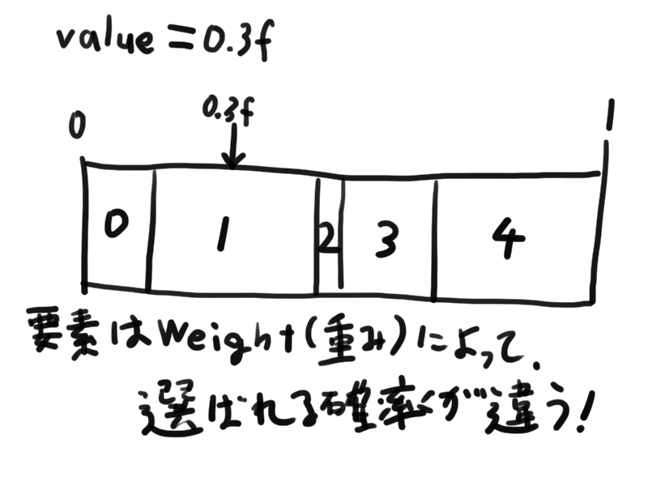

## はじめに

**「完全なランダムではなく、要素のWeight（重み）によって選ばれる確率が異なるランダムを実装したい」**という時があります。例えば「ガチャ」や「アイテムのドロップ率」とかがそれにあたります。

この記事では、そんな「WeightedRandom」の実装方法を紹介します。

## 使用例

まず、下で紹介するWeightedRandomの簡単な使用例を見てみましょう。

```cs

public class WeightedItem {
	public string id;
	public float weight;
}

public class WeightedSelector : MonoBehaviour {

	public List<WeightedItem> items = new List<WeightedItem>();

	public Select () {
		WeightedItem selectedItem = items[items.WeightedIndex(item => item.weight)];
		Debug.Log(selectedItem.id);
	}
}
```

Weightedなランダムを1行で記述できるようになります。

## WeightedRandomのコード

以下のコードは、WeightedRandomを実装するコードです。

```cs

using System;
using System.Linq;
using System.Collections.Generic;

using Random = UnityEngine.Random;

public static class WeightedRandom {

	public static int WeightedIndex (this IEnumerable<float> source) {
		return WeightedIndex(source,Random.value);
	}

	public static int WeightedIndex (this IEnumerable<float> source,float value) {
		float[] weights = source.ToArray();

		float total = weights.Sum(x => x);
		if (total <= 0f) {
			return -1;
		}

		int i = 0;
		float w = 0f;
		foreach (float weight in weights) {
			w += weight / total;
			if (value <= w) {
				return i;
			}
			i++;
			}
		return -1;
	}

	public static int WeightedIndex<T> (this IEnumerable<T> source,float value,Func<T,float> weightSelector) {
		return source
			.Select(x => weightSelector.Invoke(x))
			.WeightedIndex(value);
	}

	public static int WeightedIndex<T> (this IEnumerable<T> source,Func<T,float> weightSelector) {
		return WeightedIndex(source,Random.value,weightSelector);
	}

}
```

## イメージ

WeightedRandomがどういうことをしているかは、以下の画像を見てもらえると分かりやすいです。



## WeightedSelect関数（追記：2020/06/06）

WeightedIndex関数だと、「インデックスではなく要素を取得したい」という時にひと手間あって使い勝手が悪いことがあったので、要素の型を取得できるWeightedSelect関数を実装しました。

```cs

public static class WeightedRandom {

	// 省略

	public static T WeightedSelect<T> (this IEnumerable<T> source,Func<T,float> weightSelector) {
		int index = WeightedIndex(source,weightSelector);
		return (index >= 0) ? source.ElementAt(index) : default;
	}
}
```

## おわりに

実際に僕が開発した[「TreasureRogue」](https://play.google.com/store/apps/details?id=com.MackySoft.TreasureRogue)にて、敵のドロップアイテムや宝箱からのアイテムの選出に使ったりしています。
